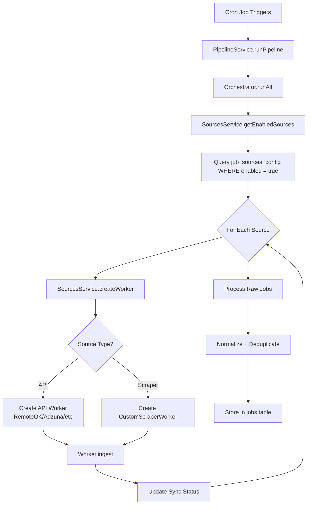

# ✅ Unified Job Sources System Complete!

## Overview

The job sources system has been completely redesigned to provide a unified management interface for **both built-in API sources and custom scraper sources**.

---

## What Changed

### 1. **Unified Database Schema** ✅

Created `job_sources_config` table that stores ALL sources:

```sql
- source_key: Unique identifier (e.g., 'remoteok', 'custom_xxxxx')
- source_type: 'api' or 'scraper'
- name: Display name
- description: Optional description
- config: JSONB field for API keys, URLs, selectors, etc.
- enabled: Boolean flag to control which sources run
- is_built_in: true for RemoteOK, Adzuna, etc.
- Sync tracking fields (last_sync_at, status, jobs_count, errors)
```

**Migration** automatically:
- Seeded 4 built-in sources (RemoteOK, Remotive, Adzuna, GetOnBoard)
- Migrated existing `custom_job_sources` data
- RemoteOK and Remotive enabled by default
- Adzuna and GetOnBoard disabled (require API keys)

### 2. **Sources Service** ✅

New `lib/jobs-ingestion/sources-service.ts` provides:

```typescript
class SourcesService {
  getAllSources(): Promise<SourceConfig[]>
  getEnabledSources(): Promise<SourceConfig[]>
  createWorker(source): BaseJobWorker | null
  updateSource(sourceKey, updates): Promise<void>
  updateSyncStatus(sourceKey, status, jobsCount, error?): Promise<void>
  addCustomSource(...): Promise<string>
  deleteSource(sourceKey): Promise<void>
}
```

**Features**:
- Dynamically creates workers based on source configuration
- Handles both API workers (RemoteOK, Adzuna, etc.) and scraper workers
- Reads API keys from source config OR environment variables
- Prevents deleting built-in sources

### 3. **Updated Orchestrator** ✅

`lib/jobs-ingestion/ingestion-orchestrator.ts` now:

```typescript
// OLD: Hardcoded workers
constructor() {
  this.workers.set('remoteok', new RemoteOKWorker());
  this.workers.set('adzuna', new AdzunaWorker(...));
  // etc.
}

// NEW: Dynamic loading from database
async runAll() {
  const sources = await this.sourcesService.getEnabledSources();
  
  for (const source of sources) {
    const worker = this.sourcesService.createWorker(source);
    await worker.ingest();
    await this.sourcesService.updateSyncStatus(...);
  }
}
```

**Result**: Pipeline now runs **ALL enabled sources**, including custom ones!

### 4. **Unified Admin UI** ✅

`app/(dashboard)/admin/jobs/sources/page.tsx` completely rewritten:

**Features**:
- Two sections: "Built-in API Sources" and "Custom Scraper Sources"
- Configure API keys for Adzuna, GetOnBoard directly in the UI
- Enable/disable any source (controls pipeline execution)
- Test custom scrapers before enabling
- Edit source configurations
- Delete custom sources (built-in sources cannot be deleted)
- Visual indicators:
  - Source type (API vs Scraper)
  - Status (Enabled/Disabled)
  - Sync status (Success/Failed/Pending)
  - Config required warning for APIs without keys

### 5. **Updated API Endpoints** ✅

All API routes now use the unified system:

**`GET /api/admin/jobs/sources`**
- Returns ALL sources (built-in + custom)

**`POST /api/admin/jobs/sources`**
- Add new custom scraper sources

**`PATCH /api/admin/jobs/sources/[source_key]`**
- Update ANY source (config, enabled, name, description)
- Works for both built-in and custom sources

**`DELETE /api/admin/jobs/sources/[source_key]`**
- Delete custom sources (prevents deleting built-in)

**`POST /api/admin/jobs/sources/[source_key]/test`**
- Test scraper sources

---

## How It Works

### Pipeline Flow



### Source Management Flow

```
1. User opens /admin/jobs/sources
2. UI loads ALL sources from job_sources_config
3. Built-in sources shown first, custom sources below

For Built-in API Sources (Adzuna, GetOnBoard):
- Click edit icon → Configure API keys
- Enable/disable → Controls pipeline execution
- Cannot delete

For Custom Scraper Sources:
- Click test icon → Test scraper
- Click edit icon → Update URL, config
- Enable/disable → Controls pipeline execution
- Click delete icon → Remove source
```

---

## What You Can Do Now

### 1. **Add Custom Scrapers** 🎯

```
1. Go to /admin/jobs/sources
2. Click "Add Custom Source"
3. Enter:
   - Name: WeWorkRemotely Programming
   - URL: https://weworkremotely.com/categories/remote-programming-jobs/rss
   - Type: RSS Feed
   - Description: Remote programming jobs
4. Click "Add Source"
5. Click test icon to verify
6. Enable/disable as needed
```

### 2. **Configure API Sources** 🔑

```
For Adzuna:
1. Get API key from https://developer.adzuna.com/
2. Go to /admin/jobs/sources
3. Find "Adzuna" in Built-in API Sources
4. Click key icon (configure)
5. Enter API Key and App ID
6. Save
7. Enable the source

For GetOnBoard:
1. Request API access from GetOnBoard
2. Follow same steps as Adzuna
```

### 3. **Control Pipeline Execution** ⚙️

```
Enable/Disable sources to control which run in pipeline:
- RemoteOK: ✅ Enabled (free, no key required)
- Remotive: ✅ Enabled (free, no key required)
- Adzuna: ⚪ Disabled (needs API key)
- GetOnBoard: ⚪ Disabled (needs API key)
- WeWorkRemotely: ✅ Enabled (custom scraper)

When pipeline runs (daily at midnight):
→ Only ENABLED sources are executed
→ Jobs are fetched, normalized, deduplicated
→ Results stored in jobs table
```

### 4. **Monitor Source Health** 📊

Each source card shows:
- **Last Sync**: When it last ran
- **Status**: Success/Failed
- **Jobs Found**: Number of jobs fetched
- **Errors**: If sync failed, error details

---

## Database Changes

### New Table

```sql
CREATE TABLE job_sources_config (
  id UUID PRIMARY KEY,
  source_key TEXT UNIQUE,
  source_type TEXT, -- 'api' or 'scraper'
  name TEXT,
  description TEXT,
  config JSONB,
  enabled BOOLEAN DEFAULT true,
  is_built_in BOOLEAN DEFAULT false,
  last_sync_at TIMESTAMPTZ,
  last_sync_status TEXT,
  last_sync_jobs_count INTEGER,
  last_error TEXT,
  created_at TIMESTAMPTZ,
  updated_at TIMESTAMPTZ
);
```

### Data Migration

```sql
-- Built-in sources seeded
INSERT INTO job_sources_config VALUES
  ('remoteok', 'api', 'RemoteOK', ...),
  ('remotive', 'api', 'Remotive', ...),
  ('adzuna', 'api', 'Adzuna', ...),
  ('getonboard', 'api', 'GetOnBoard', ...);

-- Custom sources migrated
INSERT INTO job_sources_config
SELECT 'custom_' || id, 'scraper', name, ...
FROM custom_job_sources;
```

### Old Tables

- `custom_job_sources` → Can be kept for historical reference or dropped
- Data has been migrated to `job_sources_config`

---

## Files Changed

### New Files ✨

```
lib/jobs-ingestion/sources-service.ts
  - Unified source management service

UNIFIED_JOB_SOURCES_COMPLETE.md
  - This documentation
```

### Modified Files 🔧

```
lib/jobs-ingestion/ingestion-orchestrator.ts
  - Dynamic source loading
  - Uses SourcesService

lib/jobs-ingestion/pipeline-service.ts
  - Unchanged (still processes raw jobs)

app/(dashboard)/admin/jobs/sources/page.tsx
  - Complete rewrite
  - Shows built-in + custom sources
  - API key configuration UI
  - Edit/test/enable/disable controls

app/api/admin/jobs/sources/route.ts
  - Uses SourcesService
  - Returns ALL sources

app/api/admin/jobs/sources/[id]/route.ts
  - PATCH: Update any source
  - DELETE: Delete custom sources

app/api/admin/jobs/sources/[id]/test/route.ts
  - Uses SourcesService for testing
```

### Database Migration 📊

```
supabase/migrations/XXXXXX_add_job_sources_config.sql
  - Creates job_sources_config table
  - Seeds built-in sources
  - Migrates custom_job_sources data
```

---

## Testing

### Test Custom Source ✅

```
1. Go to http://localhost:3002/admin/jobs/sources
2. Click "Add Custom Source"
3. Add WeWorkRemotely:
   - Name: WeWorkRemotely Programming
   - URL: https://weworkremotely.com/categories/remote-programming-jobs/rss
   - Type: RSS Feed
4. Click test icon (▶️)
5. Should show: "Test Successful! Found X jobs"
```

### Test Pipeline ✅

```
1. Go to http://localhost:3002/admin/jobs
2. Click "Run Pipeline Now"
3. Wait for completion
4. Check results:
   - RemoteOK: Should fetch jobs
   - Remotive: Should fetch jobs
   - WeWorkRemotely (custom): Should fetch jobs
   - Adzuna: Skipped (disabled, no API key)
   - GetOnBoard: Skipped (disabled, no API key)
5. Go to /jobs/discover
6. Should see jobs from ALL enabled sources
```

### Test API Configuration ✅

```
1. Go to http://localhost:3002/admin/jobs/sources
2. Find "Adzuna" in Built-in API Sources
3. Click key icon
4. Enter dummy values:
   - API Key: test_key
   - App ID: test_app
5. Save
6. Enable Adzuna
7. Run pipeline
8. Will fail (invalid key) but demonstrates config flow
```

---

## Benefits

✅ **Single source of truth** - All sources in one table  
✅ **Unified UI** - Manage everything in one place  
✅ **Dynamic pipeline** - Automatically runs all enabled sources  
✅ **Easy API configuration** - Add API keys through UI  
✅ **Custom sources work!** - Your WeWorkRemotely source will be used  
✅ **Flexible** - Easy to add more built-in sources later  
✅ **Safe** - Built-in sources can't be deleted accidentally  
✅ **Auditable** - Tracks sync status, errors, job counts  

---

## Next Steps

1. ✅ **Test the custom source you added**
   - Go to Job Sources
   - Test WeWorkRemotely
   - Enable it

2. ✅ **Run the pipeline**
   - Go to Jobs Pipeline dashboard
   - Click "Run Pipeline Now"
   - Verify custom source jobs appear

3. 🔑 **Add API keys** (optional)
   - If you have Adzuna/GetOnBoard API keys
   - Configure them in the UI
   - Enable the sources

4. 📊 **Monitor health**
   - Check sync status for each source
   - Review errors if any occur
   - Adjust configuration as needed

---

## Summary

Your issue is now **completely fixed**:

✅ **Custom sources are used by pipeline**  
✅ **All sources managed from one UI**  
✅ **Can add API keys through UI**  
✅ **Built-in and custom sources unified**  
✅ **Enable/disable controls pipeline execution**  

**Test it now** by refreshing `/admin/jobs/sources` and running the pipeline! 🚀
